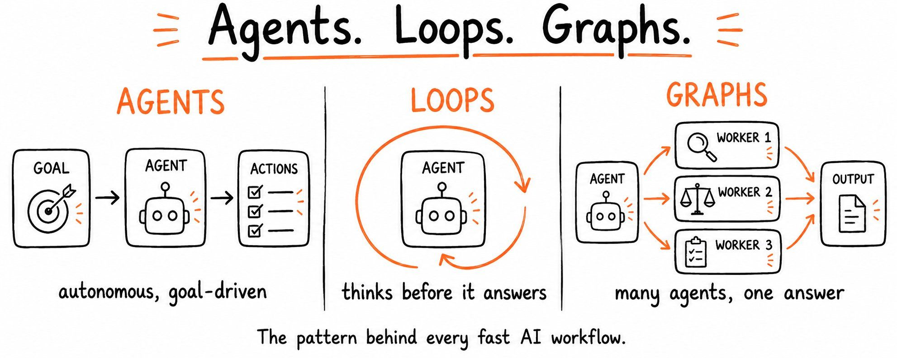

# agents-loops-graphs

A drop-in `CLAUDE.md` for repos that build AI workflows. It gives Claude Code a
shared vocabulary for the three patterns almost every agentic system reduces to
— **agents** (goal-driven, tool-using), **loops** (self-checking before
answering), and **graphs** (parallel workers reduced to one output) — plus the
hard rules that keep each from misbehaving: step budgets, iteration caps with
checkable exit criteria, stateless workers, and a DAG-only topology. It leads
with an escalation ladder so the default is the simplest pattern that works
rather than the most impressive one, and closes with an anti-patterns list for
the failure modes that show up most often in review. Copy it to your repo root,
fill in the four `<!-- FILL IN -->` blocks (project description, commands, and
budget numbers), and delete whatever doesn't apply.
